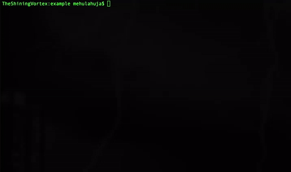

# goPacCap

Package paccap provides an easy-to-use interface for capturing
and inspecting the packets. Along comes with it is a very miniscule
implementation of IPCache.

## Getting Started 

To install the library 

```
go get github.com/hashcode55/gopaccap
```

### Dependencies 

```
go get github.com/google/gopacket
```

### Usage

```
package main

import (
	"fmt"
	"github.com/hashcode55/gopaccap"
)

func main() {	
	// First argument is cache expiration time 
	// followed by a flag for logging the cache hits 
	pc := gopaccap.PacketCapture(5, true)
	s := pc.ReadPcap("tcp", "path/to/your/pcap/file")
	for _, val := range s {
		// This prints out the packet details 
		fmt.Println(val) 
	}
}

```

**For live capture**

```
// doesn't return anything
pc.LiveCapture("tcp", "your NIC interface name")
```




## Running the tests

To run the tests, open the root of project and 

```
go test
```

## Authors

* **Mehul Ahuja** 

## License

This project is licensed under the MIT License - see the [LICENSE.md](LICENSE.md) file for details
